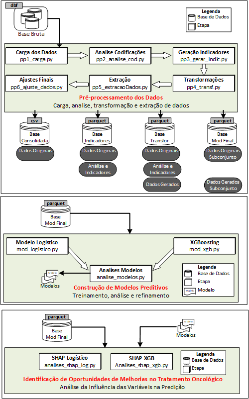

# Registros Hospitalares de Câncer (RHC) - INCA
Tratamento dos Registros Hospitalares de Câncer (RHC) - INCA, do período de 1985 até 2022 

# Autores
Ulf Bergmann - Aluno do MBA USP/Esalq - ulf@tecc2.com.br

Patrícia Belfiore Fávero - Orientadora - patricia.belfavero@gmail.com 

Dr Anke Bergmann - Pesquisadora do INCA - abergmann@inca.gov.br

Dr Luiz Claudio Santos Thuler - Pesquisador do INCA - lthuler@inca.gov.br.

## Contexto
Este projeto foi desenvolvido no contexto do MBA em Data Science e Analytics - USP/Esalq - 2025 e se baseia nos dados disponibilizados pelo IntegradorRHC, um sistema desenvolvido pelo INCA – Instituto Nacional de Câncer, para consolidação de casos assistidos nas Unidades Hospitalares após eliminação de multiplicidades. Os dados são provenientes dos Registros Hospitalares de Câncer (RHC) de todo o Brasil e são de acesso público no Instituto Nacional de Câncer, abrangendo o período de 1985 até 2022.

## Texto completo do trabalho
[**TCC Ulf Bergmann**](https://drive.google.com/uc?export=download&id=1UMaaKiLV0aFuifEHfdy-WHjCRuhMp6Jh) 

## Base de Dados do Integrador RHC
[**Integrador RHC - INCA**](https://irhc.inca.gov.br/)

## Objetivos
Este projeto foi desenvolvido a partir dos dados disponíveis no IntegradorRHC com dois objetivos principais:

a. Identificar transformações nos dados que possam completar informações ausentes, melhorando o indicador de Completude, e transformações que possam identificar e resolver inconsistências, todas com o objetivo de contribuir para que pesquisadores da área tenham acesso a melhores e mais completas informações sobre o tratamento oncológico no Brasil. 

b. Utilização da base na construção de modelos de Machine Learning para a predição da resposta ao primeiro tratamento

c. Analisar os modelos criados identificando oportunidades de melhoria nas ações de saúde pública no tratamento oncológico.

## Processo Utilizado
A figura abaixo mostra as etapas e artefatos gerados no processo de preparação dos dados obtidos a partir do RHC/INCA

## Documentação

[**Descriçao das Funções do Código Fonte**](https://ulf-tecc2.github.io/rhc_inca/site)

[**Dicionario de Dados**](https://drive.google.com/uc?export=download&id=1-n6Kq8QZONDfHlJa4a_K5-2cO8HHPWUx) 

## Conjunto de Dados

**Arquivos com os conjuntos de dados gerados - Período de 1985 a 2022** 

#### Dados brutos consolidados em um arquivo único (CSV)
[**Base Consolidada**](https://drive.google.com/uc?export=download&id=1qyhOfIxizJ61APhmKrJnQQVIi9kcMR6-) 

#### Dados originais com a adição dos resultados das análises (arquivo parquet)
[**Base Indicadores  (parquet)**](https://drive.google.com/uc?export=download&id=1IHJwb28UrgB3LBBbwIf52tQJaoI_UwGW) 

#### Dados com resultado das transformações e inferências (arquivo parquet)
[**Base Transformada  (parquet)**](https://drive.google.com/uc?export=download&id=1WPlX4Wga_6OFTU64MLJVX8dTT917tEkS) 

#### Dados de Casos Analíticos pré-processados - Prontos para uso na construção de modelos (arquivo parquet)
[**Base Modelagem (parquet)**](https://drive.google.com/uc?export=download&id=1frbCZfJOa_ZBPDG6BTGB7OsjhxMDBfs3) 

